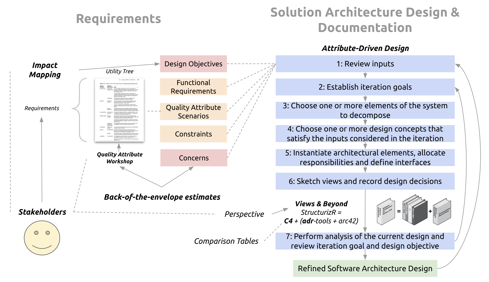

# GitHub Copilot: The Agent Awakens

## Disclaimer
> This session involves live coding with large language models, which can be a bit unpredictable. Things might go off-script, behave strangely, or simply not work. That’s all part of the fun! I appreciate your patience and curiosity as we explore together.

## Why GitHub Copilot Agent Mode?

- The next essential instrument in your developer toolkit — just like when JetBrains automated refactorings changed the way we write code.
- Integrates with your favorite IDE
- Arguably, can compete with Cursor and Windsurf feature-wise

> Acting as an autonomous peer programmer, it performs multi-step coding tasks at your command — analyzing your codebase, reading relevant files, proposing file edits, and running terminal commands and tests. It responds to compile and lint errors, monitors terminal and test output, and auto-corrects in a loop until the task is completed
> 

See the [Code Assistants Leaderboard as of April 2025](https://github.com/epam/AIRUN-Engineering-Benchmark/blob/main/pages/sandbox-test/code-assistants-2025.md) for more details.

## Agenda

- Solve 2-3 "hard" LeetCode problems with Copilot
- Implement unit tests for the solutions
- Design a URL shortener service using Copilot
- Create C4 diagrams for the service using [Structurizr](https://structurizr.com/)
- Implement the service using Aspire
- Implement [integration tests](https://learn.microsoft.com/en-us/aspnet/core/test/integration-tests?view=aspnetcore-9.0&pivots=xunit) for the service

## Key Takeaways

- Use [atomic git commits](https://www.aleksandrhovhannisyan.com/blog/atomic-git-commits/)
- Do one thing at a time
- Avoid large tasks
- Control the scope of the task for Copilot
- Don't be affraid to `git reset --hard` and start over (that's why we use atomic commits)

## Links
- [A Minimal Approach to Architecture as Code: Documenting the Modern Way](https://github.com/max-arshinov/masad)

